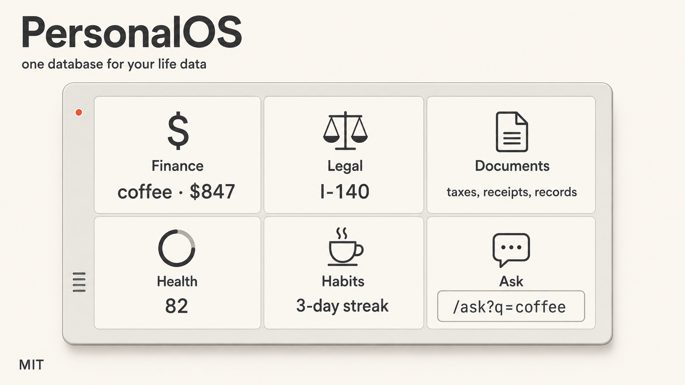

# PersonalOS



PersonalOS keeps everything you'd otherwise lose track of in one database: bank transactions, legal cases, business entity docs, taxes, sleep score, habits, journal. Claude can answer "what did I spend on coffee in 2022" because it's all in one place.

Live demo at **https://personal-os.app.blitz.dev**. 

## Fork to make your own

**Local** (private, nothing leaves your laptop)

```bash
git clone https://github.com/socialloopai/PersonalOS.git
cd PersonalOS && npm install
npx teeny generate --local && npx teeny deploy --local --yes
npx teeny dev --local
```

**Claude sets it up on Cloudflare** (persistent on the cloud accessible from your phone)

Paste into Claude Code:

```
Clone github.com/socialloopai/PersonalOS and deploy it to a new Blitz project running on Cloudflare. Install the blitz skill (`npx -y @blitzdev/skill install`) and use it first. 
```

Blitz is an infracturcture service lets Claude Code provisions a ready-made backend on Cloudflare so you do zero manual setup. Each Blitz project packages a Cloudflare Worker, SQLite database (D1), file storage (R2), and a live `<slug>.app.blitz.dev` URL. Claude uses Blitz to work on your personalOS immediately instead of doing any infrastructure setup. 


**Self-hosted on Cloudflare**

```bash
git clone https://github.com/socialloopai/PersonalOS.git
cd PersonalOS && npm install && npx wrangler login
npx teeny deploy --remote --yes
```

## What's in it

11 tabs: Home (projects with Be scores), Tasks, Finance, Legal, Taxes, Entities, Health, Reflections, Soul (habits), Ask, Profile. All CRUD via plain HTML forms, no JS framework. The only client-side script is Plaid Link.

## Integrations

- **Bank transactions**. Plaid sandbox works out of the box. Production needs your own Plaid approval (~$1-2/month). Zero-vendor path: upload statement PDFs and the `statement-importer` skill parses them with Claude.
- **Apple Health**. iOS Shortcut POSTs daily metrics to `/api/health/apple`.
- **Oura**. Paste your Personal Access Token in `/profile`, a Cloudflare cron syncs nightly.

## Claude skills

The original shipped 7 skills (add-project, add-task, add-habit, snapshot, debrief, schedule, statement-importer) that drive the OS via natural-language interviews. All ported to teenybase REST in `skills/`. Drop any folder into `~/.claude/skills/` to use with Claude Code.

See `skills/TEENYBASE-API.md` for the auth + query cheat sheet.

## License

[MIT](./LICENSE)
